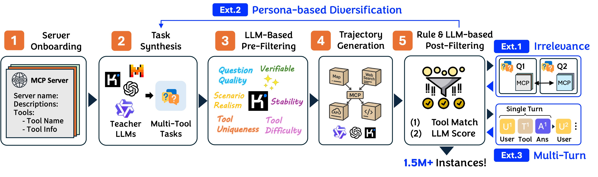

# 🦤 Toucan-1.5M: 

Toucan-1.5M is the largest fully synthetic tool-agent dataset to date, designed to advance tool use in agentic LLMs. It comprises over 1.5 million trajectories synthesized from 495 real-world Model Context Protocols (MCPs) spanning 2,000+ tools. By leveraging authentic MCP environments, Toucan-1.5M generates diverse, realistic, and challenging tasks requires using multiple tools, with trajectories involving real tool executions across multi-round, multi-turn, sequential, and parallel tool calls. Models fine-tuned on Toucan-1.5M outperform much larger closed-source counterparts on the BFCL V3 benchmark and extend the Pareto frontier on the MCP-Universe benchmark.

- 📄 [Technical Report](https://arxiv.org/abs/2510.01179) - Technical details behind Toucan-1.5M
- 💾 [Github Repo](https://github.com/TheAgentArk/Toucan) - Pipeline to produce Toucan-1.5M
- 🤗 [HF Dataset](https://huggingface.co/datasets/Agent-Ark/Toucan-1.5M) - Full dataset



## 🚚 Installation

```bash
# Create Env
conda create -n toucan python=3.12 -y
conda activate toucan

# Install Required Packages
pip install torch
pip install -r requirements.txt

# Install Qwen Agent from Source
cd Qwen-Agent; pip install -e .; cd ../
```

## 📝 Data Synthesis

Please refer to [`./datagen`](./datagen/) folder for details.

## 📚 Citation

If you find the data or code useful, please cite:
```
@misc{xu2025toucan,
      title={TOUCAN: Synthesizing 1.5M Tool-Agentic Data from Real-World MCP Environments}, 
      author={Zhangchen Xu and Adriana Meza Soria and Shawn Tan and Anurag Roy and Ashish Sunil Agrawal and Radha Poovendran and Rameswar Panda},
      year={2025},
      eprint={2510.01179},
      archivePrefix={arXiv},
      primaryClass={cs.LG},
      url={https://arxiv.org/abs/2510.01179}, 
}
```